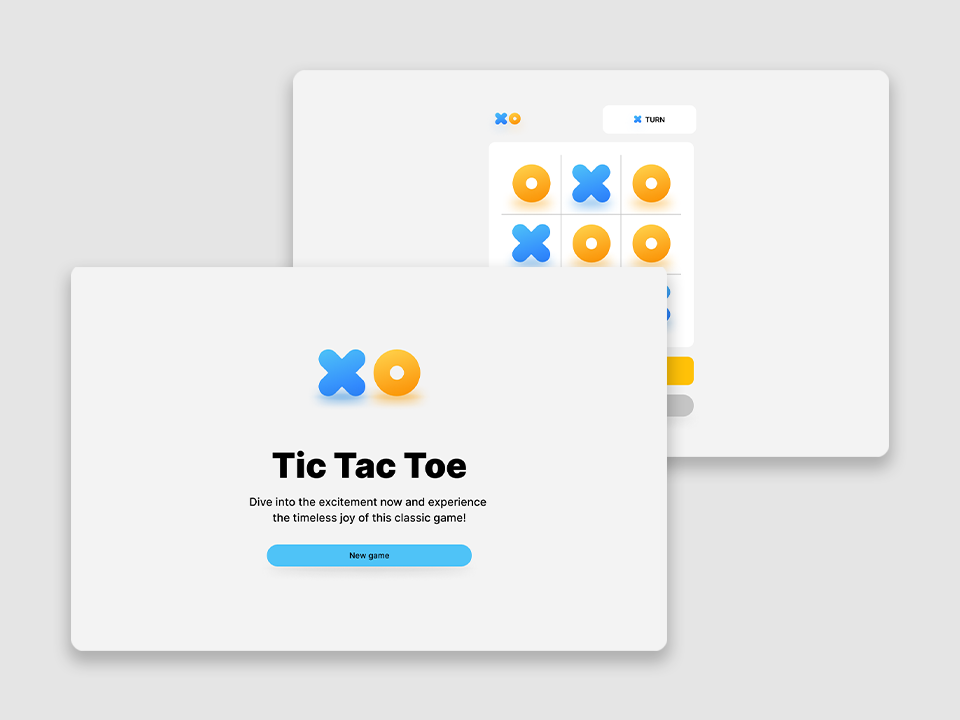

# Tic Tac Toe Project Using React Js
[App coding still in process]

A classic two-player game focusing on aligning three symbols in a row on a 3x3 grid.

## Project brief

Embark on a journey into the world of classic gaming with **Tic Tac Toe**. This project allows you to build a web-based version of the timeless strategy game. Immerse yourself in creating an interactive platform where players can play against CPU, engage in the game, and celebrate victories or draw conclusions. Tailored for desktop, tablet, and mobile experiences, this project is perfect for those who enjoy combining classic gaming with modern web development.

## Get started

1. Create a react app using [ npm create vite@latest] , then delete all the folders except "node_modules".
2. Copy all the project files to this new empty folder (Your Created APP Folder).
3. Configure your Coding setup
4. Add SASS to your react app [npm install sass] then [npm install scss]
5. Run to test.

Enjoy the game!
